# aboutty

aboutty generates animated terminal-style SVGs for GitHub READMEs and other
static documentation. Define commands, prompts, output, timing, colors, and
frames in JSON, then render a portable SVG that can be committed to your
repository and embedded like a normal image.



## Studio

Use the static Studio to design a configuration visually, preview the SVG, and
download the files you need:

https://gateway.irys.xyz/GvAz6otathZ5HNUFWimsCKLTNqzjCWwUSM1SmtfTRufF/

The Studio can export:

- `aboutty.json` configuration
- GitHub Actions workflow template
- JSON schema
- Rendered SVG

Because aboutty is designed for static READMEs, the recommended flow is to
generate the SVG in your repository and embed the generated file. It does not
depend on a hosted dynamic SVG endpoint.

## Quick Start

Create `aboutty.json`:

```json
{
  "$schema": "./schema/aboutty.schema.json",
  "title": "aboutty demo",
  "username": "aboutty",
  "hostname": "dev",
  "cwd": "~",
  "prompt": "$",
  "loop": true,
  "cursor": {
    "enabled": true,
    "style": "block",
    "blinkIntervalMs": 650
  },
  "steps": [
    {
      "type": "command",
      "text": "pnpm test"
    },
    {
      "type": "output",
      "typingIntervalMs": 0,
      "text": [
        { "value": "Tests ", "color": "#f8fafc" },
        { "value": "passed", "color": "#6ee7b7", "bold": true }
      ]
    }
  ]
}
```

Render it with the CLI:

```sh
npm install -D @aboutty/cli
npx aboutty aboutty.json --out assets/aboutty.svg
```

Embed it in Markdown:

```md

```

## GitHub Action

Use the GitHub Action when you want the SVG to be generated automatically from
`aboutty.json`.

```yaml
name: Generate aboutty SVG

on:
  workflow_dispatch:
  push:
    paths:
      - aboutty.json

permissions:
  contents: write

jobs:
  generate:
    runs-on: ubuntu-latest
    steps:
      - uses: actions/checkout@v6
      - uses: pbandj082/aboutty/packages/action@action-v0
        with:
          config: aboutty.json
          output: assets/aboutty.svg
          commit: "true"
          push: "true"
```

Action inputs:

| Input | Default | Description |
| --- | --- | --- |
| `config` | `aboutty.json` | Path to the aboutty JSON config. |
| `output` | `assets/aboutty.svg` | Path where the SVG should be written. |
| `commit` | `false` | Commit the generated SVG when it changes. |
| `push` | `false` | Push the commit when `commit` is enabled. |

If you prefer full control over the commit step, omit `commit` and `push`, then
add your own `git diff`, `git add`, `git commit`, and `git push` commands.

## CLI

The CLI package is `@aboutty/cli`.

```sh
npm install -D @aboutty/cli
npx aboutty <config.json> --out <output.svg>
```

Examples:

```sh
npx aboutty examples/basic.json --out assets/aboutty.svg
npx aboutty examples/docker-tutorial.json --out assets/docker.svg
```

## Core API

Use `@aboutty/core` when you want to render SVGs from your own Node.js code.

```sh
npm install @aboutty/core
```

```ts
import { renderSvg, type AbouttyConfig } from "@aboutty/core";

const config: AbouttyConfig = {
  title: "demo",
  steps: [
    { type: "command", text: "node --version" },
    { type: "output", text: "v24.0.0" }
  ]
};

const svg = renderSvg(config);
```

Useful exports include:

- `renderSvg(config)` - render an SVG string
- `validateConfig(config)` - validate config shape
- `resolveConfig(config)` - merge user config with defaults
- TypeScript types such as `AbouttyConfig`, `AbouttyStep`, and
  `AbouttyTextSegment`

## Configuration

An aboutty config describes the terminal window and a timeline of steps.

Top-level fields:

| Field | Description |
| --- | --- |
| `title` | Terminal title text. |
| `width` | SVG width in pixels. |
| `username`, `hostname`, `cwd`, `prompt` | Prompt parts shown before commands. |
| `loop` | Whether the full SVG animation repeats. |
| `cursor` | Blinking command cursor settings. |
| `stepIntervalMs` | Default pause between steps. |
| `typingIntervalMs` | Default typing interval for text. Use `0` for instant output. |
| `theme` | Terminal colors. |
| `steps` | Ordered command/output timeline. |

Cursor styles:

| Style | Description |
| --- | --- |
| `block` | Filled block cursor. |
| `outline` | Outlined block cursor. |
| `bar` | Vertical bar cursor. |
| `underline` | Underline cursor. |

Each step has a `type` of `command` or `output` and a `text` value. `text` can be
a string or an array of styled segments:

```json
{
  "type": "output",
  "text": [
    { "value": "status: ", "color": "#94a3b8" },
    { "value": "ok", "color": "#6ee7b7", "bold": true }
  ]
}
```

Frame segments can animate one visual position through multiple values:

```json
{
  "type": "output",
  "text": [
    {
      "frames": [
        "| resolving",
        "/ fetching",
        "- linking",
        "\\ done"
      ],
      "frameIntervalMs": 140,
      "color": "#6ee7b7"
    }
  ]
}
```

Individual frames may also override style:

```json
{
  "frames": [
    { "value": "plan graph [####----] 25%", "color": "#818cf8" },
    { "value": "plan graph [########] 100%", "color": "#86efac", "bold": true }
  ],
  "frameIntervalMs": 180
}
```

See [schema/aboutty.schema.json](./schema/aboutty.schema.json) for the complete
schema.

## Examples

The [examples](./examples) directory includes ready-to-render templates for:

- basic getting started flow
- npm install output
- Git and Docker tutorials
- GitHub Actions and release pipelines
- kubectl rollout, Terraform plan, database migration, and test runner output
- profile-style README metadata
- local monitor / hacker-style console output

Render any example with:

```sh
npx aboutty examples/terraform-plan.json --out assets/terraform-plan.svg
```

## Packages

| Package | Purpose |
| --- | --- |
| `@aboutty/core` | TypeScript renderer, config types, validation, and timeline helpers. |
| `@aboutty/cli` | Command line SVG generator. |
| `packages/action` | GitHub Action for repository automation. |
| `apps/studio` | Static Studio used to edit configs and preview SVGs. |
| `scripts/deploy-irys` | Manual Irys deployment script for the Studio build. |

## Studio Deployment

The hosted Studio is deployed manually to Irys because deployment costs fees.
For maintainers:

```sh
pnpm build
pnpm deploy:irys
```

Use a local `.env` file to point at a Solana keypair file without storing the key
inside the repository:

```env
IRYS_PRIVATE_KEY_FILE=~/.config/solana/id.json
IRYS_DEPLOY_DIR=apps/studio/dist
IRYS_INDEX_FILE=index.html
```

The deploy script prints the estimated upload cost and current Irys balance
before uploading. Type `deploy` at the prompt to continue.

## License

MIT. See [LICENSE](./LICENSE).
